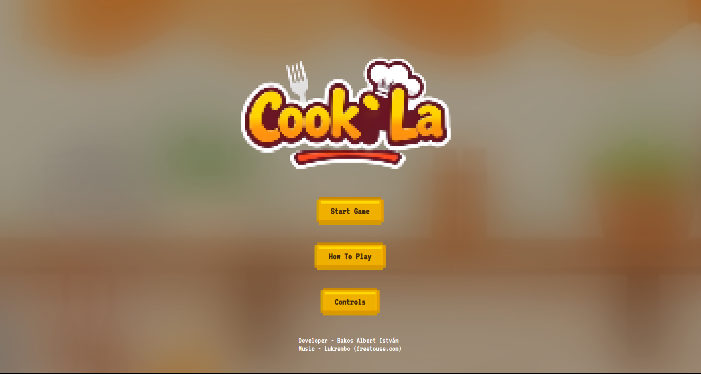

# Cook`La

## A projektről
A Cook`La egy tanulóprojekt, amely egy egyetemi beadandó alapjaira épül. A beadás után további ötletekkel bővítettem, és folyamatosan fejlesztem tovább. Az ötletet az *Overcooked* játéksorozat inspirálta. A játék főként JavaScriptre, valamint HTML-re és CSS-re épül. A legtöbb grafikai elem saját készítésű.  

Jövőben terveim között szerepel a projekt TypeScriptre történő átírása és további játékmenetet bővítő funkciók hozzáadása.

## Alkalmazott technológiák

**JavaScript** – Játéklogika  
**HTML** – Struktúra  
**CSS** – Stílus és vizuális elemek  

## A játék indítása

### 1. Fejlesztői környezet használata
A projektet indíthatjuk WebStorm-ban (natív webszerver) vagy Visual Studio Code-ban (Live Server bővítménnyel). 
Más környezet is használható, ha támogat webszerver indítást. 

#### Lépések:
1. Klónozd a projektet
2. Nyisd meg a kiválasztott IDE-t
3. Nyisd meg a projektet
4. Válaszd ki az `index.html` fájlt
5. Indítsd webszerverként

> Ha mindent jól csináltál, a játék elindul, és játszhatsz vele.

### 2. GitHub Pages
Kattints a lentebb lévő `Játék indítása` szövegre és a játék azonnal elindul a böngészőben:  
[Játék indítása](https://bakosalbert.github.io/Cook-La/)

> Ha mindent jól csináltál, a játék elindul, és játszhatsz vele.

## Képernyőképek

  
  
  

## Megjegyzések
- Ha az `index.html` fájlt webszerver nélkül futtatjuk, a játék nem fog elindulni.  
- A játék folyamatosan készül és fejlődik így kisebb hibák és hiányosságok előfordulhatnak.
